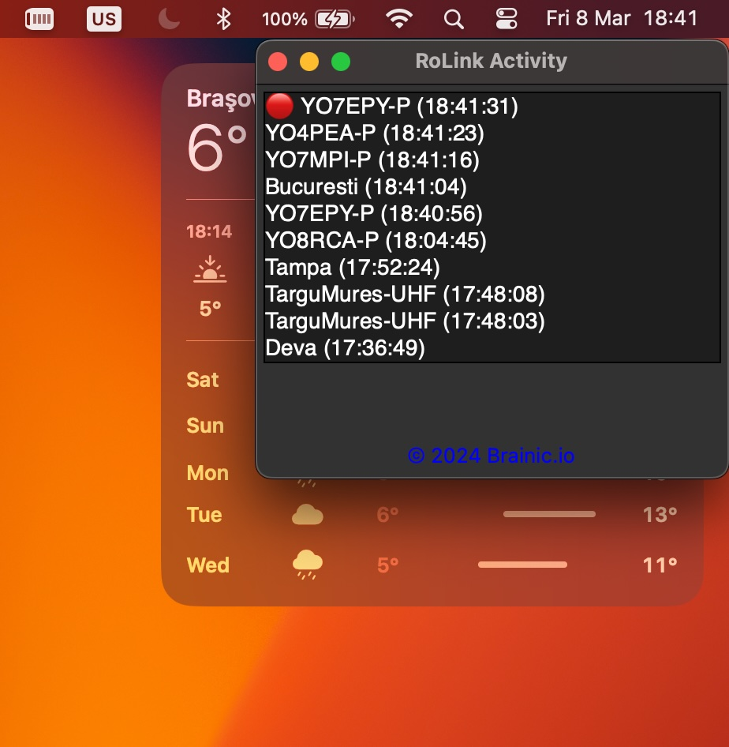

# RoLink Activity Desktop

## Despre

**RoLink Activity Desktop** este o aplicație desktop ce rulează în foreground (rămâne în prim-plan mereu, în fața altor
aplicații) care se conectează la
serviciul [RoLink](https://rolink.network) pentru a monitoriza și afișa activitatea în timp real a vorbitorilor pentru a
vă ajuta să știți cu cine comunicați în timp ce lucrați la PC.

Utilizând tehnologia WebSocket pentru comunicarea în timp real, această aplicație vă permite să vedeți ultimii vorbitori
activi în rețea, marcându-i pe cei actuali cu un indicator vizual distinct.

## Funcționalități

- Conectare în timp real la serviciul RoLink folosind WebSocket.
- Afișarea ultimilor 100 vorbitori activi, cu evidențierea vorbitorului curent.
- Interfață simplă și intuitivă, ușor de utilizat.
- Afișarea numelor vorbitorilor: Pe lângă indicativul radio (call sign), aplicația extrage și afișează _prenumele_
  vorbitorilor
  provenit din [callbook-ul oferit de ANCOM](https://www.ancom.ro/radioamatori_2899); sau dacă acolo nu este găsit, din
  serviciul QRZ.com, facilitând identificarea persoanelor din rețea.

## Rulare

Build-urile pentru diferite sisteme de operare pot fi găsite în
secțiunea [Releases](https://github.com/BrainicHQ/rolink-activity-desktop/releases) a repository-ului GitHub.

## Descărcare Directă

### Despre avertismentul de securitate pe Windows

Pe sistemele de operare Windows, este posibil să primiți un avertisment de securitate la descărcarea și rularea
aplicației. 

Acesta este un avertisment standard pentru aplicațiile care nu sunt semnate digital. Pentru a continua,
faceți click pe "More info" și apoi pe "Run anyway". 

Aplicația nu conține viruși sau malware, și este sigură de
utilizat. _Dacă aveți îndoieli, puteți verifica codul sursă al aplicației._ 

#### Pentru a descărca direct aplicația, faceți click pe link-ul corespunzător sistemului de operare:

- [**MacOS**](https://github.com/BrainicHQ/rolink-activity-desktop/releases/latest/download/RoLink-Activity-macOS.zip)
  🍎
- [**Windows** (recomandat)](https://github.com/BrainicHQ/rolink-activity-desktop/releases/latest/download/RoLink-Activity-Windows.exe)
  🖥️
    - [Windows 7](https://github.com/BrainicHQ/rolink-activity-desktop/releases/latest/download/RoLink-Activity-Windows7.exe)
      (pentru sistemele mai vechi) 📜 🖥️
- [**Linux**](https://github.com/BrainicHQ/rolink-activity-desktop/releases/latest/download/RoLink-Activity-Linux) 🐧

## Contribuții

Contribuțiile sunt binevenite! Dacă doriți să contribuiți la acest proiect, vă rugăm să urmați acești pași:

1. Fork repository-ul.
2. Creați o nouă branch pentru modificările dumneavoastră (`git checkout -b feature/YourFeatureName`).
3. Faceți commit modificărilor (`git commit -am 'Add some feature'`).
4. Push la branch (`git push origin feature/YourFeatureName`).
5. Deschideți un Pull Request.

## Suport

Pentru întrebări sau suport, vă rugăm să deschideți o problemă în secțiunea Issues a repository-ului GitHub.

## Mulțumiri

Mulțumiri speciale către [YO6NAM @ RoLink](https://rolink.network) pentru crearea API-ului websocket necesar pentru
această aplicație.