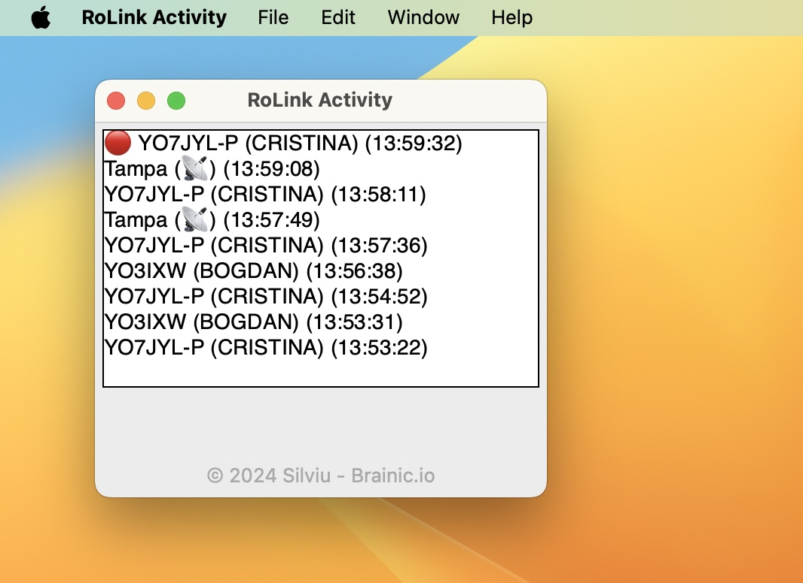

# RoLink Activity Desktop

## Despre

**RoLink Activity Desktop** este o aplicație desktop ce rulează în foreground care se conectează la serviciul [RoLink](https://rolink.network) pentru a monitoriza și afișa activitatea în timp real a vorbitorilor pentru a vă ajuta să știți cu cine comunicați în timp ce lucrați la PC. 

Utilizând tehnologia WebSocket pentru comunicarea în timp real, această aplicație vă permite să vedeți ultimii vorbitori activi în rețea, marcându-i pe cei actuali cu un indicator vizual distinct.

[](preview.jpg)

## Funcționalități

-   Conectare în timp real la serviciul RoLink folosind WebSocket.
-   Afișarea ultimilor 100 vorbitori activi, cu evidențierea vorbitorului curent.
-   Interfață simplă și intuitivă, ușor de utilizat.
-   Afișarea Nume Vorbitorilor: Pe lângă indicativul radio, aplicația acum extrage și afișează numele vorbitorilor provenit din [callbook-ul oferit de ANCOM](https://www.ancom.ro/radioamatori_2899), facilitând identificarea persoanelor din rețea.

## Instalare

Build-urile pentru diferite sisteme de operare pot fi găsite în secțiunea [Releases](https://github.com/BrainicHQ/rolink-activity-desktop/releases) a repository-ului GitHub.

### Descărcare Directă

- [MacOS](https://github.com/BrainicHQ/rolink-activity-desktop/releases/latest/download/RoLink-Activity-macOS.zip) 🍎
- [Windows](https://github.com/BrainicHQ/rolink-activity-desktop/releases/latest/download/RoLink-Activity-Windows.exe) 🖥️
- [Linux](https://github.com/BrainicHQ/rolink-activity-desktop/releases/latest/download/RoLink-Activity-Linux) 🐧

## Rulare

După instalarea dependențelor, puteți rula aplicația executând:

```bash
python rolink-activity.py
```

## Contribuții

Contribuțiile sunt binevenite! Dacă doriți să contribuiți la acest proiect, vă rugăm să urmați acești pași:

1.  Fork repository-ul.
2.  Creați o nouă branch pentru modificările dumneavoastră (`git checkout -b feature/YourFeatureName`).
3.  Faceți commit modificărilor (`git commit -am 'Add some feature'`).
4.  Push la branch (`git push origin feature/YourFeatureName`).
5.  Deschideți un Pull Request.

## Suport

Pentru întrebări sau suport, vă rugăm să deschideți o problemă în secțiunea Issues a repository-ului GitHub.

## Mulțumiri
Mulțumiri speciale către [YO6NAM @ RoLink](https://rolink.network) pentru crearea API-ului websocket necesar pentru această aplicație.